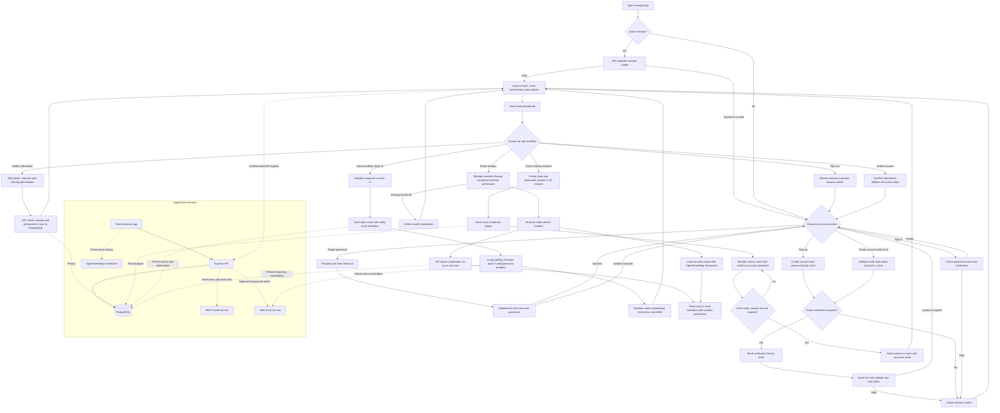

# FamilyPulse workflow

```mermaid
flowchart TD
    START[Open FamilyPulse] --> SESSION{Active session?}
    SESSION -->|Yes| VALIDATE[API validates session cookie]
    VALIDATE -->|Valid| LOAD[Load account, circle, permissions and updates]
    VALIDATE -->|Expired or invalid| AUTH
    SESSION -->|No| AUTH{Choose an account action}

    AUTH -->|Sign up| SIGNUP[Create account and personal family circle]
    SIGNUP --> VERIFY_REQUIRED{Email verification required?}
    VERIFY_REQUIRED -->|Yes| VERIFY_LINK[Send verification link by email]
    VERIFY_LINK --> VERIFY[Open link and validate one-time token]
    VERIFY -->|Valid| CREATE_SESSION[Create session cookie]
    VERIFY -->|Invalid or expired| AUTH
    VERIFY_REQUIRED -->|No| CREATE_SESSION
    AUTH -->|Sign in| LOGIN[Check password and email verification]
    LOGIN -->|Valid| CREATE_SESSION
    LOGIN -->|Invalid| AUTH
    AUTH -->|Forgot password| RESET_LINK[Request one-time reset link]
    RESET_LINK --> RESET[Validate link and save new password]
    RESET -->|Success| AUTH
    RESET -->|Invalid or expired| AUTH
    AUTH -->|Create account with invite| INVITE_SIGNUP[Validate invite and create account in circle]
    INVITE_SIGNUP --> VERIFY_REQUIRED

    CREATE_SESSION --> LOAD
    LOAD --> DASHBOARD[View family dashboard]
    DASHBOARD --> ACTION{Choose an app workflow}
    ACTION -->|Health information| PROFILE[Edit profile, contacts and sharing permissions]
    PROFILE --> SAVE_PROFILE[API checks session and permissions; save to PostgreSQL]
    SAVE_PROFILE --> LOAD

    ACTION -->|Invite a family member| INVITE[Create code and passcode; expires in 15 minutes]
    INVITE --> HASH[Store invite credential digest]
    HASH --> JOIN[Member enters invite and confirms account password]
    JOIN --> INVITE_VALID{Invite valid, unused and not expired?}
    INVITE_VALID -->|Yes| MEMBERSHIP[Add member to circle and consume invite]
    INVITE_VALID -->|No| JOIN
    MEMBERSHIP --> LOAD

    ACTION -->|Manual safety check-in| CHECKIN[Member requests a check-in]
    CHECKIN --> EVENT[Save open event and notify circle members]
    EVENT --> ALERT[In-app polling; browser push if configured and enabled]
    ALERT --> RESPONSE[Member marks responding, resolved or cancelled]
    RESPONSE --> LOAD

    ACTION -->|Share location| CONSENT[Member enables sharing and grants browser permission]
    CONSENT --> GEO[Browser reads device location]
    GEO --> LOCATION[API stores coordinates for up to one hour]
    LOCATION --> MAP[Show only to circle members with location permission]
    GEO --> REVERSE[Look up street name with OpenStreetMap Nominatim]
    REVERSE --> MAP
    CONSENT -->|Sharing turned off| DELETE_LOCATION[Delete saved coordinates]
    DELETE_LOCATION --> LOAD

    ACTION -->|Sign out| LOGOUT[Revoke session and clear session cookie]
    LOGOUT --> AUTH
    ACTION -->|Delete account| DELETE_ACCOUNT[Confirm permanent deletion of account data]
    DELETE_ACCOUNT --> AUTH

    subgraph SERVICES[Application services]
        CLIENT[React browser app] --> API[Express API]
        API --> DB[(PostgreSQL)]
        API -. Verification and reset links .-> SMTP[SMTP email service]
        API -. Optional background alerts .-> PUSH[Web Push service]
        CLIENT -. Street-name lookup .-> OSM[OpenStreetMap Nominatim]
    end

    LOAD -. Authenticated API request .-> API
    SAVE_PROFILE -. Persist .-> DB
    HASH -. Persist digest .-> DB
    EVENT -. Persist events and notifications .-> DB
    LOCATION -. Persist temporary coordinates .-> DB
    ALERT -. Deliver when subscribed .-> PUSH
```

FamilyPulse check-ins are initiated by a member; the app does not detect medical events or contact emergency services. Wearable and live-monitoring features are not active.
